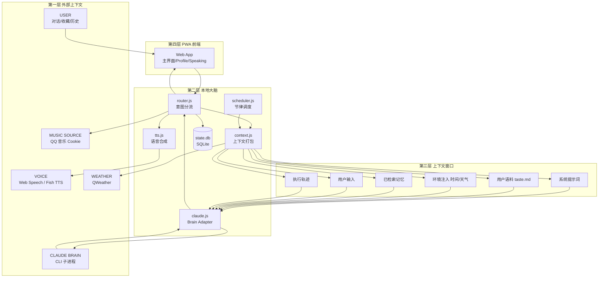
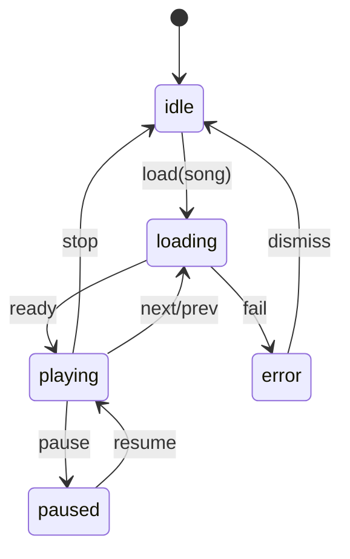
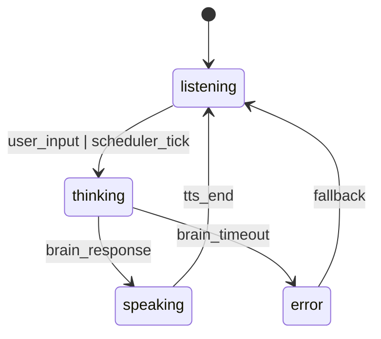
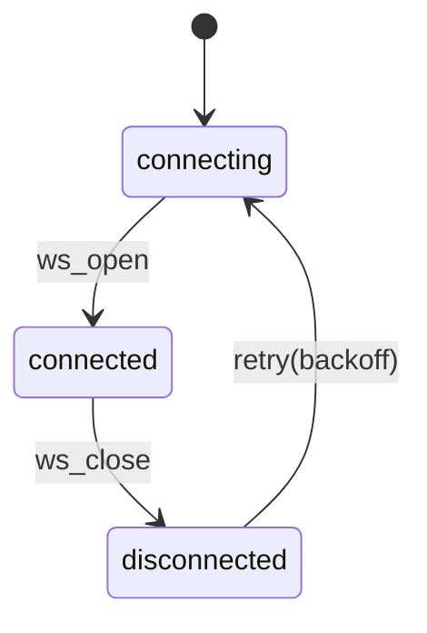

# Claudio · 个人 AI 电台 PWA · 产品需求文档（PRD v1.0）

| 项 | 内容 |
|---|---|
| 文档版本 | v1.0 |
| 作者 | 产品经理（虚拟角色） |
| 日期 | 2026-04-27 |
| 状态 | 待评审 |
| 关联施工图 | [`../img/main.png`](../img/main.png) |
| 一句话定位 | lizi 的私人 DJ —— 一份会打碟的 `taste.md` |

## 目录

- [1. 产品愿景](#1-产品愿景)
- [2. 目标用户](#2-目标用户)
- [3. 核心价值主张](#3-核心价值主张)
- [4. 功能模块总览](#4-功能模块总览)
- [5. 第一期 P0 功能清单](#5-第一期-p0-功能清单)
- [6. 第二期展望（P1/P2）](#6-第二期展望p1p2)
- [7. 非功能需求](#7-非功能需求)
- [8. HTTP 契约（6 条）](#8-http-契约6-条)
- [9. 状态机](#9-状态机)
- [10. 边界与异常](#10-边界与异常)
- [11. 系统依赖与密钥清单](#11-系统依赖与密钥清单)
- [12. 度量指标](#12-度量指标)
- [13. 术语表](#13-术语表)
- [14. 开放问题](#14-开放问题)

---

## 1. 产品愿景

> **Your mood is my prompt. I hate algorithm. I have taste.**

Claudio 是一座只为一个人广播的私人电台。它不是另一个推荐算法，也不是另一个聊天机器人——它是一个**理解你品味、跟随你节律、能主动播报、能即时打碟**的 AI DJ。

整个系统跑在你自己的电脑上，以一份纯文本的 `taste.md` 作为人格底座，以 Claude Code CLI 作为大脑，以 QQ 音乐作为本期音源。打开它就像把电台打开，一开机我就打碟。

## 2. 目标用户

| 维度 | 描述 |
|---|---|
| 角色 | 极客 / 设计师 / 内容创作者 / 独立开发者 |
| 使用场景 | 工作 BGM、深夜独处、写作前氛围铺垫、做内容时找参考音乐 |
| 关键诉求 | 不被算法绑架、希望音乐贴近当下心情与场景、希望有一个"懂自己"的存在主动出招 |
| 反向画像 | 喜欢被动接收热门榜的用户不是目标用户 |

本期为**单人单机**模型：一个用户、一台电脑、一份品味档案。

## 3. 核心价值主张

| 对比对象 | Claudio 的差异 |
|---|---|
| Spotify / 网易云 算法推荐 | 算法不可解释；Claudio 的每一次选歌都能告诉你"为什么是这首"，且依据来自你自己的 `taste.md` |
| ChatGPT / 通用聊天机器人 | 通用机器人不会主动播报、不会触摸音乐控件；Claudio 是被授权操作播放器的 Agent |
| 智能音箱 | 音箱以指令式交互为主；Claudio 以对话 + 节律调度为主，更像电台 DJ 而非工具 |

## 4. 功能模块总览



模块对齐 [`../img/main.png`](../img/main.png) 四层施工图，未做删减。

## 5. 第一期 P0 功能清单

> 验收标准统一采用 **Given-When-Then** 格式。

### F-001 点阵 LED 时钟与 ON AIR 指示

| 项 | 内容 |
|---|---|
| 用户故事 | 作为听众，我希望进入页面就看到一块复古点阵时钟和"ON AIR"指示，让我有打开电台的仪式感 |
| 验收标准 | **Given** 用户打开主页面 **When** 页面加载完成 **Then** 顶部呈现 `21:11` 样式的点阵时钟，秒位冒号每秒闪烁，下方一行显示 `Monday 28 APR 2026`，时钟旁有圆点 + `ON AIR` 文字，圆点以 2s 周期呼吸 |
| 优先级 | P0 |
| 依赖 | 无 |
| 参考截图 | [`../img/2.png`](../img/2.png) [`../img/3.png`](../img/3.png) |

### F-002 播放器条

| 项 | 内容 |
|---|---|
| 用户故事 | 作为用户，我希望能像传统播放器一样控制当前曲目 |
| 验收标准 | **Given** 当前有正在播放的曲目 **When** 用户操作控件 **Then** 上一首/播放暂停/下一首/停止/收藏/HIDE 队列/FAV 收藏夹/音量/进度条均按预期响应；进度条支持拖拽 seek；当前曲名与艺人左侧呈现，状态文字显示 `PLAYING` 或 `PAUSED` |
| 优先级 | P0 |
| 依赖 | F-013 |
| 参考截图 | [`../img/2.png`](../img/2.png) |

### F-003 播放队列 QUEUE

| 项 | 内容 |
|---|---|
| 用户故事 | 我希望随时看到接下来要放的几首歌，并能点击切歌 |
| 验收标准 | **Given** 队列里有 N 首待播曲 **When** 用户展开 QUEUE **Then** 列表呈现编号/曲名/艺人/时长，当前播放曲左侧有竖条高亮；**When** 点击其中一行 **Then** 立即切到该曲 |
| 优先级 | P0 |
| 依赖 | F-002 |
| 参考截图 | [`../img/3.png`](../img/3.png) |

### F-004 Claudio LIVE 对话流

| 项 | 内容 |
|---|---|
| 用户故事 | 我希望能看到 Claudio 的播报历史与当下回应 |
| 验收标准 | **Given** Claudio 产生过一条播报 **When** 进入主界面 **Then** LIVE 区按时间倒序呈现消息卡片，每条带头像/名字/时间戳/正文/REPLAY 按钮；点 REPLAY 可重放 TTS |
| 优先级 | P0 |
| 依赖 | F-005、F-010、F-011 |
| 参考截图 | [`../img/3.png`](../img/3.png) [`../img/9.png`](../img/9.png) |

### F-005 用户输入框

| 项 | 内容 |
|---|---|
| 用户故事 | 我希望随时和 Claudio 对话或下达指令 |
| 验收标准 | **Given** 输入框聚焦 **When** 输入文本并回车或点发送 **Then** 消息进入对话流并触发后端 `POST /api/chat`；麦克风按钮支持 Web Speech 语音转文本（不可用时按钮置灰并 hover 提示） |
| 优先级 | P0 |
| 依赖 | F-004 |
| 参考截图 | [`../img/2.png`](../img/2.png) |

### F-006 Profile 弹层

| 项 | 内容 |
|---|---|
| 用户故事 | 我希望了解 Claudio 是谁、它现在的工作量、它的擅长风格 |
| 验收标准 | **Given** 用户点击头像 **When** 弹层打开 **Then** 展示头像/Claudio 名/签名/简介/三列统计（ON AIR 24-7、GENRES ∞、LISTENER 1）/风格标签云；点遮罩或 ESC 关闭 |
| 优先级 | P0 |
| 依赖 | 无 |
| 参考截图 | [`../img/5.png`](../img/5.png) [`../img/7.png`](../img/7.png) |

### F-007 主题切换 DARK / LIGHT

| 项 | 内容 |
|---|---|
| 用户故事 | 白天和深夜我希望分别使用浅色与深色 |
| 验收标准 | **Given** 头部右侧有 DARK / LIGHT 两态切换 **When** 用户点击另一态 **Then** 全局 CSS 变量切换且记忆到 localStorage |
| 优先级 | P0 |
| 依赖 | 无 |
| 参考截图 | [`../img/2.png`](../img/2.png) [`../img/3.png`](../img/3.png) |

### F-008 登录入口

| 项 | 内容 |
|---|---|
| 用户故事 | 单机版仍保留登录入口形式，便于将来扩展多用户 |
| 验收标准 | **Given** 头部 LOGIN 按钮 **When** 点击 **Then** 本期弹出"本地单用户模式"提示并自动以 `mmguo` 身份登录；不阻塞主流程 |
| 优先级 | P0 |
| 依赖 | 无 |
| 参考截图 | [`../img/2.png`](../img/2.png) |

### F-009 手机竖屏 Speaking 态

| 项 | 内容 |
|---|---|
| 用户故事 | 在手机上我希望以"播报中"的全屏沉浸态使用 Claudio |
| 验收标准 | **Given** 视口宽度 < 768 且当前正在 TTS 播报或播歌 **When** 进入 Speaking 路由 **Then** 顶部呈现实时音频波形可视化，中部白色卡片显示曲名/艺人/进度条，下部呈现歌词流，逐行 fade-in，当前行底色高亮关键词 |
| 优先级 | P0 |
| 依赖 | F-002、F-013 |
| 参考截图 | [`../img/6.png`](../img/6.png) [`../img/4.png`](../img/4.png) |

### F-010 Claudio 主动播报与节律调度

| 项 | 内容 |
|---|---|
| 用户故事 | 我希望 Claudio 像真实电台 DJ 一样在固定节点主动开口 |
| 验收标准 | **Given** `scheduler.js` 已启动 **When** 时间到达预设节律（07:00 早间规划 / 09:00 单曲 / 整点情绪检查 / 22:00 收尾推荐） **Then** 后端推送一条 `ws:/stream` 事件，前端在 LIVE 区追加一条新播报，可选自动 TTS |
| 优先级 | P0 |
| 依赖 | F-004、F-014 |

### F-011 意图分流

| 项 | 内容 |
|---|---|
| 用户故事 | 我希望 Claudio 能区分"播放周杰伦"这类直接指令与"今天有点累"这类自然对话 |
| 验收标准 | **Given** 用户消息进入 `router.js` **When** 命中"播放/换一首/暂停/收藏"等动词模式 **Then** 直接路由到 MusicProvider 不走 LLM；**When** 未命中模式 **Then** 走 `claude.js` 调 Brain |
| 优先级 | P0 |
| 依赖 | F-005、F-013 |

### F-012 品味语料文件驱动

| 项 | 内容 |
|---|---|
| 用户故事 | 我希望 Claudio 的人格与品味由我手动编辑的几份纯文本驱动 |
| 验收标准 | **Given** `user/` 目录下存在 `taste.md` / `routines.md` / `playlists.json` / `mood-rules.md` **When** 后端启动或文件变更 **Then** `context.js` 重新加载并注入到 Claude 上下文窗口 P2 片 |
| 优先级 | P0 |
| 依赖 | F-010、F-011 |

### F-013 QQ 音乐集成（Cookie）

| 项 | 内容 |
|---|---|
| 用户故事 | 我希望 Claudio 能在 QQ 音乐里搜歌、取直链、取歌词、放歌 |
| 验收标准 | **Given** `.env` 配置了 `QQ_MUSIC_COOKIE` **When** 调用 `MusicProvider.search('keyword')` / `getUrl(songId)` / `getLyric(songId)` **Then** 返回结构化结果；**When** Cookie 为空或失效 **Then** 自动 fallback 到 `MockProvider`（本地 mp3）且前端显示一条提示 |
| 优先级 | P0 |
| 依赖 | 系统依赖 |
| 备注 | 抽象为 `MusicProvider` 接口，预留 NetEase / Spotify 实现位 |

### F-014 天气注入（QWeather）

| 项 | 内容 |
|---|---|
| 用户故事 | 我希望 Claudio 在主动播报中能引用今天的天气与温度 |
| 验收标准 | **Given** `.env` 配置了 `QWEATHER_KEY` 和 `LOCATION_ID` **When** `context.js` 打包上下文 **Then** P3 环境注入片中包含当前天气、温度、未来 6 小时趋势 |
| 优先级 | P0 |
| 依赖 | F-010 |

### F-015 持久化（SQLite state.db）

| 项 | 内容 |
|---|---|
| 用户故事 | 重启服务后历史对话、播放记录、计划不应丢失 |
| 验收标准 | **Given** 后端运行期间产生消息/播放/计划/偏好数据 **When** 服务重启 **Then** 主界面 LIVE 区、QUEUE、Plan-of-Day 数据完整恢复 |
| 优先级 | P0 |
| 依赖 | 全部 |
| 备注 | 表结构：`messages` / `plays` / `plan` / `prefs` 四张表 |

## 6. 第二期展望（P1/P2）

| ID | 模块 | 优先级 | 说明 |
|---|---|---|---|
| F2-001 | Fish Audio 高保真 TTS | P1 | 替代 Web Speech，更接近真人 DJ |
| F2-002 | 飞书日历集成 | P1 | 把今日会议作为环境注入 P3 |
| F2-003 | ~~UPnP 客厅播放~~ | ❌ | 已确认不做，永久移除 |
| F2-004 | 多音源切换（NetEase / Spotify） | P1 | 通过 MusicProvider 注册机制 |
| F2-005 | 多用户与多电台 | P2 | 单机模型升级为多 taste 切换 |
| F2-006 | iOS / Android 原生壳 | P2 | PWA → Capacitor |

## 7. 非功能需求

| 维度 | 指标 |
|---|---|
| 性能 | 首屏 TTI < 2s（M2 MacBook，本机回环），WS 端到端延迟 < 200ms |
| 离线 | Service Worker 缓存壳层资源，离线时降级显示\"OFF AIR\"且不白屏 |
| 兼容性 | Chrome / Edge / Safari 最新两版；iOS Safari 需自动播放白名单 |
| 可访问性 | 全局 focus ring，键盘可达所有控件，对比度 ≥ AA |
| 可观测性 | 后端结构化日志（pino），前端关键事件埋点写入 `messages` 表 |
| 安全 | Cookie / API Key 仅读 `.env`，严禁前端暴露；本机 127.0.0.1 监听 |

## 8. HTTP 契约（6 条）

> 全部 JSON over HTTP/WS，监听 `127.0.0.1:5173`。

### 8.1 `POST /api/chat`

```json
// Request
{ "text": "今天做内容，帮我挑 BGM" }

// Response
{
  "say": "好，给你挑 5 首...",
  "play": [
    { "songId": "0039MnYb0qxYhV", "name": "Sign of the Times", "artist": "Harry Styles" }
  ],
  "reason": "前奏入耳氛围感强，匹配你 taste.md 第 12 行偏好",
  "segue": "下一首想换风格随时说"
}
```

### 8.2 `GET /api/now`

```json
{ "song": { "id": "...", "name": "...", "artist": "...", "url": "...", "lyric": "..." }, "position": 42.3, "state": "playing" }
```

### 8.3 `GET /api/next`

```json
{ "queue": [ { "id": "...", "name": "...", "artist": "...", "duration": 213 } ] }
```

### 8.4 `GET /api/taste`

```json
{ "taste": "...markdown 全文...", "routines": "...", "playlists": [...], "moodRules": "..." }
```

### 8.5 `GET /api/plan/today`

```json
{ "date": "2026-04-27", "blocks": [ { "time": "07:00", "type": "morning_brief", "summary": "..." } ] }
```

### 8.6 `WS /stream`

```jsonc
// Server → Client 事件
{ "type": "claudio_say", "ts": 1714230000, "text": "...", "playId": "..." }
{ "type": "now_changed", "song": { ... } }
{ "type": "queue_changed", "queue": [ ... ] }
{ "type": "tts_start" | "tts_end", "playId": "..." }
```

## 9. 状态机

### 9.1 播放器状态



### 9.2 Claudio 对话状态



### 9.3 连接状态



## 10. 边界与异常

| 场景 | 降级方案 |
|---|---|
| Claude CLI 不可用 / 超时 | `claude.js` 返回兜底 `say: "我在打盹，稍后再聊"`，不影响播放器 |
| QQ 音乐 Cookie 失效 | 自动切到 `MockProvider`，前端 LIVE 区追加一条系统消息提示 |
| 网络断开 | WS 重连指数退避；HTTP 接口走本地缓存 `state.db` |
| 音频加载失败 | 自动跳到队列下一首；连续失败 3 首则停止并播报 |
| TTS 失败 | 自动降级为浏览器 SpeechSynthesis，再失败则只显示文本 |
| `taste.md` 缺失 | 后端启动时生成模板文件并写入默认人格，不阻塞启动 |

## 11. 系统依赖与密钥清单

> 所有密钥通过项目根 `.env` 统一配置，详见 `docs/.env.example`（开发专家产出）。

| 密钥名 | 用途 | 来源 | P0 必填 | 默认值 / 缺失行为 |
|---|---|---|---|---|
| `BRAIN_CLI_CMD` | Brain CLI 命令名 | 本机 PATH | 是 | `claude` |
| `BRAIN_CLI_ARGS` | CLI 附加参数 | 自定义 | 否 | `-p --output-format json` |
| `QQ_MUSIC_COOKIE` | QQ 音乐 Cookie 字符串 | 浏览器 F12 复制 | 否（缺失则 Mock） | 空字符串 |
| `QWEATHER_KEY` | 和风天气 API Key | dev.qweather.com 注册 | 是（F-014） | 缺失则环境注入跳过天气 |
| `QWEATHER_LOCATION` | 默认城市 LocationID | 同上 | 是 | `101010100`（北京） |
| `FISH_AUDIO_KEY` | Fish Audio TTS Key | fish.audio 注册 | 否（P1） | 缺失则用 Web Speech |
| `FEISHU_APP_ID` | 飞书应用 ID | open.feishu.cn | 否（P1） | — |
| `FEISHU_APP_SECRET` | 飞书应用 Secret | 同上 | 否（P1） | — |
| `PORT` | 服务监听端口 | 自定义 | 否 | `5173` |
| `LOG_LEVEL` | 日志级别 | 自定义 | 否 | `info` |

## 12. 度量指标

| 指标 | 目标 | 采集方式 |
|---|---|---|
| 日均对话轮次 | ≥ 10 | `messages` 表按日聚合 |
| 日均播放曲目数 | ≥ 20 | `plays` 表按日聚合 |
| 主动播报成功率 | ≥ 95% | scheduler 触发 / 完成 比值 |
| Brain 响应 P95 时延 | < 4s | `claude.js` 埋点 |
| 音频首字节时延 | < 800ms | `MusicProvider.getUrl` 埋点 |

## 13. 术语表

| 术语 | 解释 |
|---|---|
| DJ | Disc Jockey，电台主持，引申为 Claudio 的角色 |
| 电台 | 指 Claudio 这种"持续播报 + 持续放歌"的产品形态 |
| 品味语料 | `user/` 下的 markdown / json，描述用户音乐口味与节律 |
| 意图分流 | `router.js` 决定走音乐控制路径还是走 LLM 路径 |
| 节律调度 | `scheduler.js` 在固定时间点驱动 Claudio 主动开口 |
| Brain Adapter | 将 Claude CLI 子进程封装为统一调用接口 |

## 14. 开放问题

1. **歌词版权与展示边界**：QQ 音乐返回的歌词是否可在 PWA 完整展示？是否需要加来源水印？— 需法务确认
2. **Mock 模式样曲**：第一期 Mock Provider 用哪几首本地 mp3 作为 demo 素材？是否使用无版权 CC0 音乐？
3. **Speaking 态触发策略**：手机端进入 Speaking 是用户手动切换还是检测到 TTS/播放自动切？两种都做？
4. **`taste.md` 模板**：第一份种子 `taste.md` 由产品经理草拟还是用户自填？
5. **节律调度时间点**：07:00 / 09:00 / 22:00 是否合用户作息？是否做成 `routines.md` 配置项？

---

*[Contains Unverified Assumptions]：Section 5 中 F-009 / F-010 的具体动效与节律时间为基于截图与常识的合理推断；Section 8 的 JSON schema 为草案，待开发评审收敛。*
