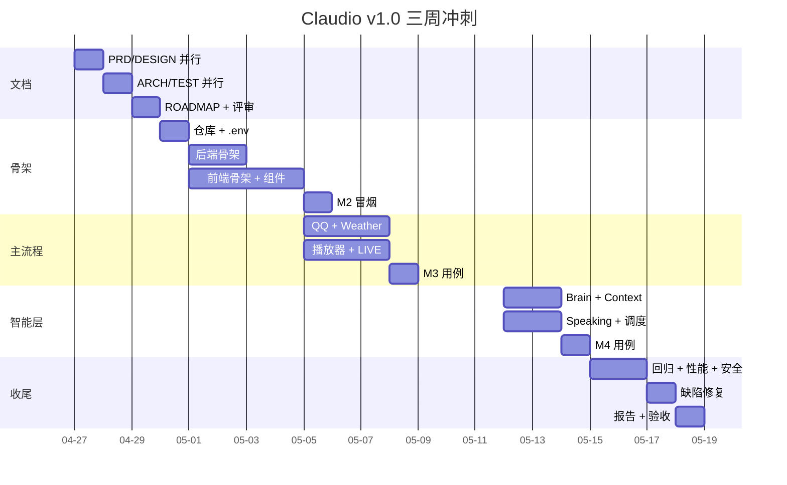

# Claudio · 项目里程碑与进度计划（ROADMAP v1.0）

| 项 | 内容 |
|---|---|
| 文档版本 | v1.0 |
| 作者 | 项目管理专家（虚拟角色） |
| 日期 | 2026-04-27 |
| 关联文档 | [`./PRD.md`](./PRD.md) [`./DESIGN.md`](./DESIGN.md) [`./ARCHITECTURE.md`](./ARCHITECTURE.md) [`./TEST_PLAN.md`](./TEST_PLAN.md) |

## 目录

- [1. 项目概览](#1-项目概览)
- [2. 里程碑](#2-里程碑)
- [3. WBS 任务分解](#3-wbs-任务分解)
- [4. 甘特图](#4-甘特图)
- [5. 关键路径与依赖](#5-关键路径与依赖)
- [6. 角色与 RACI](#6-角色与-raci)
- [7. 风险登记册](#7-风险登记册)
- [8. 沟通与汇报机制](#8-沟通与汇报机制)
- [9. 验收与上线](#9-验收与上线)
- [10. 第二期展望](#10-第二期展望)

---

## 1. 项目概览

| 项 | 内容 |
|---|---|
| 项目名 | Claudio · 个人 AI 电台 PWA |
| 期次 | 第一期（v1.0） |
| 起止 | 2026-04-27 ~ 2026-05-18（3 周）|
| 团队 | 产品 1 / 设计 1 / 开发 1 / 测试 1 / PM 1（多角色由 AI 协作扮演） |
| 验收人 | mmguo（用户本人） |
| 交付物 | 5 份文档 + 可运行 PWA 骨架 + `.env.example` 统一配置 + 测试报告 |

## 2. 里程碑

| M# | 里程碑 | 日期 | 交付物 | 验收标准 |
|---|---|---|---|---|
| **M0** | 启动对齐 | 2026-04-27 | 决策对齐（音源/Brain/交付形态） | 用户回复 A/B/C 决策 |
| **M1** | 文档 v1 完成 | 2026-04-29 | PRD + DESIGN + ARCH + TEST + ROADMAP | 五份文档齐备且互相一致 |
| **M2** | 骨架可启动 | 2026-05-04 | server/ + pwa/ + `.env.example` | `npm start` 起服务，PWA 主页能开 |
| **M3** | 主流程跑通 | 2026-05-11 | F-001 ~ F-008 / F-013 / F-015 全部跑通 | Mock 模式 + 真 QQ Cookie 双路径走通 |
| **M4** | 智能层完整 | 2026-05-15 | F-010 / F-011 / F-012 / F-014 | Brain 子进程稳定、节律调度真实触发 |
| **M5** | 测试报告 + 验收 | 2026-05-18 | TEST_REPORT v1.0 | 通过率 ≥ 95%；用户验收 ✅ |

## 3. WBS 任务分解

### 3.1 阶段 A：文档（M0 → M1）

| ID | 任务 | 角色 | 工时 | 依赖 |
|---|---|---|---|---|
| A-01 | 撰写 PRD v1 | 产品 | 6h | M0 |
| A-02 | 撰写 DESIGN v1 | 设计 | 6h | M0 |
| A-03 | 撰写 ARCHITECTURE v1 | 开发 | 5h | A-01 |
| A-04 | 撰写 TEST_PLAN v1 | 测试 | 4h | A-01、A-03 |
| A-05 | 撰写 ROADMAP v1 | PM | 3h | A-01~A-04 |
| A-06 | 文档评审 | 全员 | 2h | A-01~A-05 |

### 3.2 阶段 B：骨架（M1 → M2）

| ID | 任务 | 角色 | 工时 | 依赖 |
|---|---|---|---|---|
| B-01 | 仓库初始化 + 目录创建 | 开发 | 1h | A-06 |
| B-02 | `.env.example` 编写（含全部备注） | 开发 | 2h | A-03 |
| B-03 | `server/` Express + WS 入口 | 开发 | 3h | B-01 |
| B-04 | SQLite state.js + 表结构 | 开发 | 2h | B-03 |
| B-05 | router.js 意图分流 | 开发 | 2h | B-03 |
| B-06 | MusicProvider 抽象 + Mock 实现 | 开发 | 3h | B-03 |
| B-07 | claude.js Brain Adapter（含容错解析） | 开发 | 4h | B-03 |
| B-08 | scheduler.js cron 框架 | 开发 | 1h | B-03 |
| B-09 | `pwa/` Vite + index.html 骨架 | 开发 | 2h | B-01 |
| B-10 | 设计 token CSS + 字体引入 | 开发 | 2h | A-02 |
| B-11 | LED Clock / Player Bar / Queue 三组件 | 开发 | 5h | B-09、B-10 |
| B-12 | LIVE Panel + Input Bar | 开发 | 4h | B-09、B-10 |
| B-13 | Profile Modal + Theme Toggle | 开发 | 3h | B-09、B-10 |
| B-14 | api.js + WS 客户端 + store | 开发 | 2h | B-03、B-09 |
| B-15 | M2 冒烟测试 | 测试 | 2h | B-01~B-14 |

### 3.3 阶段 C：主流程（M2 → M3）

| ID | 任务 | 角色 | 工时 | 依赖 |
|---|---|---|---|---|
| C-01 | QQ MusicProvider 实现（search/getUrl/getLyric） | 开发 | 8h | B-06 |
| C-02 | QWeather Provider 实现 | 开发 | 2h | B-03 |
| C-03 | Plays 表 / 收藏 / 队列管理 | 开发 | 3h | B-04 |
| C-04 | 进度条 / 音量 / 拖拽 seek | 开发 | 3h | B-11 |
| C-05 | LIVE 实时推送 + REPLAY TTS | 开发 | 4h | B-12 |
| C-06 | F-001~F-008 / F-013 / F-015 用例执行 | 测试 | 6h | C-01~C-05 |

### 3.4 阶段 D：智能层（M3 → M4）

| ID | 任务 | 角色 | 工时 | 依赖 |
|---|---|---|---|---|
| D-01 | context.js 6 片组装 + 缓存 | 开发 | 4h | M3 |
| D-02 | 节律调度真实触发 + 推送 | 开发 | 3h | D-01 |
| D-03 | 品味语料文件加载 + 监听 | 开发 | 2h | D-01 |
| D-04 | Speaking 路由 + 波形 + 歌词同步 | 开发 | 6h | M3 |
| D-05 | F-010 / F-011 / F-012 / F-014 / F-009 用例 | 测试 | 6h | D-01~D-04 |

### 3.5 阶段 E：收尾（M4 → M5）

| ID | 任务 | 角色 | 工时 | 依赖 |
|---|---|---|---|---|
| E-01 | 全量回归 + 视觉对图复核 | 测试 | 6h | M4 |
| E-02 | 性能压测 + 边界异常 | 测试 | 4h | M4 |
| E-03 | 安全测试（SQLi/XSS/密钥） | 测试 | 3h | M4 |
| E-04 | 缺陷修复 buffer | 开发 | 8h | E-01~E-03 |
| E-05 | TEST_REPORT 编写 | 测试 | 2h | E-01~E-04 |
| E-06 | 用户验收会 | PM + 用户 | 1h | E-05 |

## 4. 甘特图



## 5. 关键路径与依赖

**关键路径**（任一节点延误整体延误）：

```
M0 → A-01(PRD) → A-03(ARCH) → B-03(后端入口) → B-07(Brain) → C-01(QQ)
   → D-01(Context) → D-02(调度) → E-01(回归) → E-04(修复) → E-06(验收)
```

**外部依赖**（标注 `[外部依赖风险]`）：

| 依赖 | 风险 | 缓解 |
|---|---|---|
| 用户本机 `claude` CLI 可调 | 若 CLI 输出 schema 与预期不一致 | `safeParseBrainOutput` 三层兜底 + 预留 BRAIN_CLI_CMD 切换 |
| QQ 音乐 Cookie 有效 | Cookie 过期或风控 | 自动 fallback Mock；用例 TC-F013-04/05 覆盖 |
| QWeather 配额 | 免费版 1000 次/天 | context.js 5 分钟 TTL 缓存 |

## 6. 角色与 RACI

| 任务 | 产品 | 设计 | 开发 | 测试 | PM |
|---|---|---|---|---|---|
| PRD | **R/A** | C | C | C | I |
| DESIGN | C | **R/A** | C | I | I |
| ARCHITECTURE | C | I | **R/A** | C | I |
| 编码 | I | C | **R/A** | I | I |
| 测试 | I | I | C | **R/A** | I |
| 验收 | C | I | C | C | **R/A** |

R=负责 / A=批准 / C=咨询 / I=知会。

## 7. 风险登记册

| ID | 风险 | 概率 | 影响 | 等级 | 应对 |
|---|---|---|---|---|---|
| R-01 | Brain CLI 输出 schema 偏离 | 中 | 高 | P0 | 三层 JSON 解析 + 默认兜底 say |
| R-02 | QQ 音乐接口签名变更 | 中 | 中 | P1 | MusicProvider 抽象 + Mock fallback |
| R-03 | Speaking 歌词同步精度差 | 中 | 中 | P1 | LRC 时间戳偏移自动校准 ± 200ms |
| R-04 | 单角色 AI 协作出现冲突需求 | 低 | 中 | P1 | 文档评审节点（A-06）做横向一致性检查 |
| R-05 | 视觉对图差异 > 2% | 中 | 低 | P2 | 设计 token 对照截图调色，开发交付前自检 |
| R-06 | SQLite 文件锁冲突 | 低 | 低 | P2 | better-sqlite3 同步 API 单线程，问题概率极低 |
| R-07 | iOS Safari 自动播放限制 | 高 | 中 | P1 | 首次进入要求用户点一次 PLAY，后续可自动 |

## 8. 沟通与汇报机制

| 节点 | 形式 | 内容 |
|---|---|---|
| 每日 | 站会（异步，AI 协作场景下用 commit message） | 昨天 / 今天 / 阻塞 |
| 里程碑 | 进度报告（追加到本文件 §进度日志） | 实际 vs 计划、风险更新 |
| 异常 | 即时同步给用户 | 关键路径阻塞 > 4h 必须报 |
| 验收 | 验收会 | 现场跑 §11 验收清单 |

### 8.1 进度日志（动态追加）

```markdown
## 进度日志

### 2026-04-27（M0 完成）
- 用户决策已锁定：A=文档+骨架，B=本机 claude CLI（DeepSeek 后端），C=QQ Cookie + Mock fallback
- 五份文档全部 v1 落地（PRD / DESIGN / ARCH / TEST / ROADMAP）
- 进入阶段 B 骨架编码
```

## 9. 验收与上线

### 9.1 验收流程

1. PM 召集验收会，共享屏幕
2. 按 TEST_PLAN §11 验收清单逐项跑
3. 任意一条 P0 项不通过则 ☐ 不通过
4. 通过后用户在 ROADMAP 末尾签字（commit signature）

### 9.2 上线动作

- 本期为本地单机产品，"上线" = 在用户机器上 `npm start` 长驻
- 提供 `pm2` / `launchctl` 守护脚本作为附赠
- 文档归档版本 tag：`v1.0.0`

## 10. 第二期展望

| 期次 | 主题 | 关键功能 | 预计周期 |
|---|---|---|---|
| v1.1 | 音质 & 触达 | Fish TTS / iOS Safari 自动播放白名单 | 1 周 |
| v1.2 | 节律 & 计划 | 飞书日历集成 / Plan-of-Day 编辑 UI | 2 周 |
| v1.3 | 多源 | NetEase / Spotify Provider 实装 | 2 周 |
| ~~v1.4~~ | ~~客厅 UPnP 投射~~ | ❌ 已移除 | 不做 |
| v2.0 | 多用户 | taste 多档案 + 用户切换 | 4 周 |

---

*[Boundary Warnings]*
- 三周排期假设单角色 AI 协作每天稳定 6h 有效产出，若用户决策回路 > 24h 需顺延
- M3 → M4 之间 Brain 联调一旦失败，可能消耗整段 buffer，留有 E-04 8h 修复时间应对

*[Contains Unverified Assumptions]*
- 工时估算基于"独立 AI 协作开发"经验值，非真人团队基准
- 节律调度时间点（07:00/09:00/22:00）暂按常识假定，需 mmguo 在验收时确认
